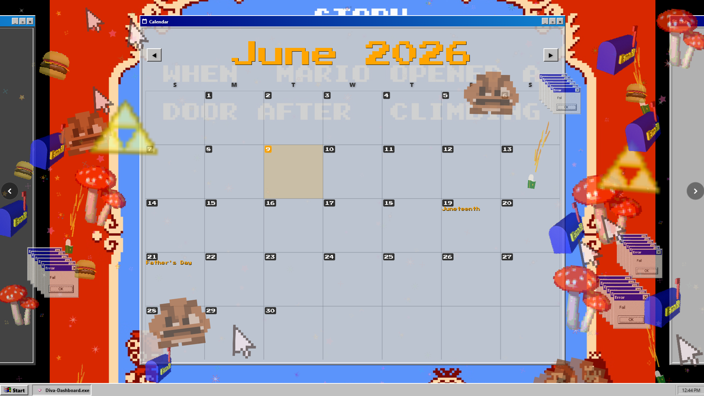
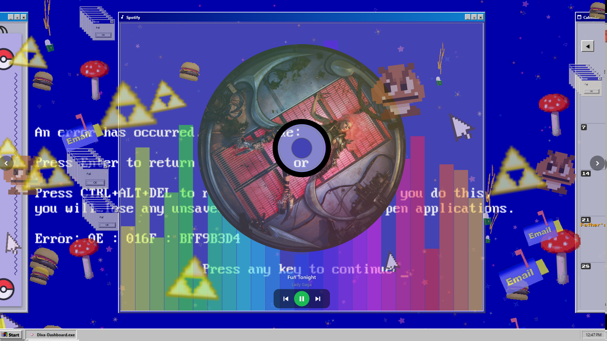

# Diva Dashboard

A Win95-styled Windows desktop dashboard, designed to run fullscreen on
a kitchen-mounted secondary monitor. Combines a calendar, task lists,
Spotify control, YouTube background videos, animated sticker overlays,
and a Fakémon-style catching minigame into one nostalgic Win95 desktop.

Built with Flutter for Windows desktop. Tested at 1920×1280 and
fullscreen on secondary displays.




---

## What's included

This repo ships as a **complete, runnable dashboard** — clone, fill in a
few API keys, and you have a working install:

- Full Flutter/Dart source (`lib/`, `windows/`, `web/`)
- A pre-populated 219-entry Fakémon gachadex (the
  [Mongratis collection](https://pokengine.org/collections/107s7x9x/Mongratis))
  with sprites under `assets/gachamon/`
- Background images, sticker graphics, sparkle overlays, type icons,
  pixel font — everything `lib/` references

What you bring:

- **Flutter SDK** (3.x, Windows desktop enabled)
- **OAuth credentials** for Google Calendar, Spotify, and optionally
  YouTube — copy `.env.example` to `.env` and fill it in. See the
  [OAuth credentials](#oauth-credentials) section below.

---

## Building

```bash
# Get dependencies
flutter pub get

# Build the Windows release exe
flutter build windows --release
# → build/windows/x64/runner/Release/kitchen_dashboard.exe
```

---

## Project layout

```
kitchen_dashboard_public/
├── .env.example                 OAuth credential template (copy to .env)
├── gachadex.json                Active gachadex (219 Mongratis entries)
├── gachamon_game.json           Persistent game state (gachaballs + catches)
├── video_backgrounds.json       YouTube URLs for background videos
├── lists.json                   Task-list names
├── mongratis_credits.md         Artist attributions
├── assets/
│   ├── backgrounds/             Dashboard background images + graphics
│   ├── fonts/                   PressStart2P pixel font
│   ├── gachamon/                Per-generation sprite folders
│   └── icons/                   UI icons + type icons
└── lib/
    ├── main.dart                Window setup
    ├── database/database.dart   Drift tables (Habits, Tasks, AuthTokens)
    ├── gachamon/                Gachamon data model + game logic
    ├── screens/                 One screen per feature + DashboardScreen
    ├── widgets/                 Win95 styling, cards, sticker layer, etc.
    ├── services/                Drift-backed + external APIs
    ├── providers/               Riverpod state
    └── theme/                   Colors, theme, animated backgrounds
```

---

## OAuth credentials

The dashboard talks to three external services. Each needs its own
credential.

### 1. Copy the template

```bash
cp .env.example .env
```

### 2. Google Calendar

1. Go to [Google Cloud Console → Credentials](https://console.cloud.google.com/apis/credentials).
2. Create OAuth 2.0 Client ID, application type **Desktop app**.
3. Enable the **Google Calendar API** for the project.
4. Add `http://127.0.0.1:8889/callback` as an authorized redirect URI.
5. Paste the client ID and secret into `.env`.

### 3. Spotify

1. Go to the [Spotify Developer Dashboard](https://developer.spotify.com/dashboard).
2. Create an app.
3. Under app settings, add `http://127.0.0.1:8888/callback` to the
   redirect URIs.
4. Paste the client ID and secret into `.env`.

### 4. YouTube (optional)

Only needed if you want video backgrounds. Create an API key at
[Google Cloud Console → Credentials](https://console.cloud.google.com/apis/credentials)
with the **YouTube Data API v3** enabled and paste it into `.env`.

Inside the app, click **Start → Settings** to authenticate with Google
and Spotify after the keys are in place.

---

## Customizing the gachadex

The shipped `gachadex.json` is the Mongratis collection.

To author your own dex from scratch, edit `gachadex.json` directly —
schema lives in `lib/gachamon/gachamon_data.dart` (`Gachamon.fromJson`).
Drop matching sprites at
`assets/gachamon/generation_<N>/<id4>_<fileStem>.png` (the path check in
`sticker_layer.dart` requires the substring `gachamon` somewhere in the
path so stickers get the outline + holo shimmer treatment).

---

## Adding your own background art

- **Backgrounds**: drop images in `assets/backgrounds/` — any
  `.png`/`.jpg`/`.apng`/`.gif`/`.webp` becomes a selectable background.
- **Sticker graphics**: drop in `assets/backgrounds/graphics/` —
  scattered as decorative overlays on the dashboard.
- **Sparkle particles**: drop in `assets/backgrounds/sparkles/`.
- **Holiday icons**: `assets/icons/holidays/<HolidayName>.png` —
  rendered next to calendar days. Falls back to `Icons.event` if
  missing.

After adding files, `flutter clean && flutter build windows --release`
to repackage assets.

---

## Credits

The 219 creatures in the shipped gachadex are from the
[Mongratis collection](https://pokengine.org/collections/107s7x9x/Mongratis)
on Pokengine — a community-curated Fakémon dex explicitly licensed for
free use in non-commercial fan games, with attribution. See
[`mongratis_credits.md`](mongratis_credits.md) for the full artist list.

---

## License

[MIT](LICENSE). Sprite art retains its original Mongratis licensing as
described in the LICENSE file.
